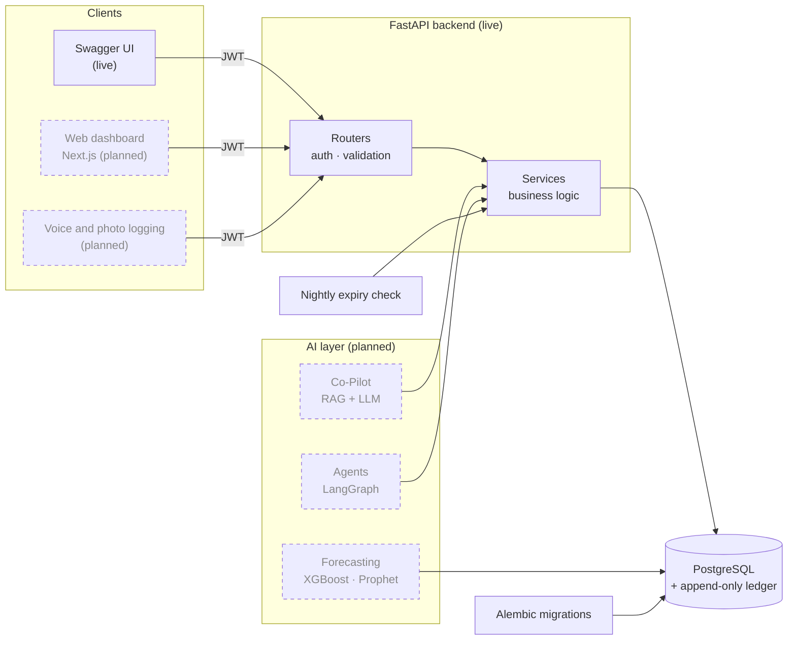
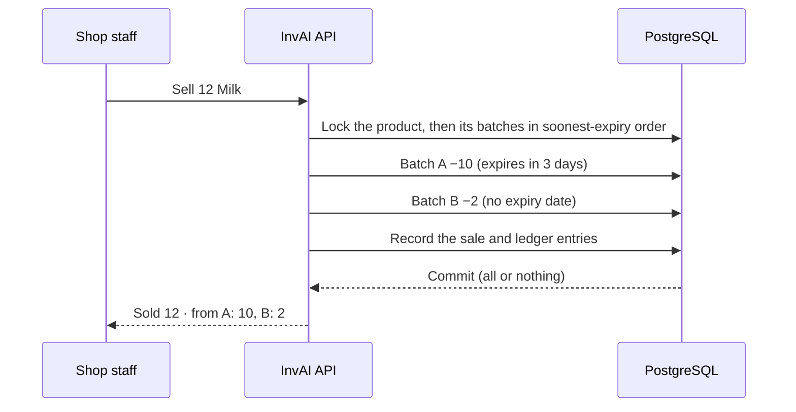
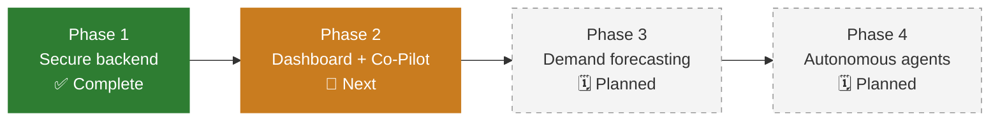

<div align="center">

# InvAI — AI-Powered Supply Chain Intelligence Platform (SaaS)

### Enterprise-grade inventory intelligence, built for the neighbourhood shop.

From a single kirana store to a multi-location chain: track every batch, sell what expires first,<br/>
catch waste before it happens, and know which suppliers you can trust.

<br/>


**[Why InvAI](#-why-invai)** · **[Highlights](#-engineering-highlights)** · **[Features](#-features)** · **[Architecture](#%EF%B8%8F-architecture)** · **[Tech Stack](#-tech-stack)** · **[Roadmap](#%EF%B8%8F-roadmap)** · **[Quick Start](#-quick-start)**

</div>

---

> [!NOTE]
> **Where the project stands:** the **backend is complete** (Phase 1) and covered by an automated test suite. The web dashboard and the AI layer, including the Co-Pilot, forecasting and autonomous agents, are being built in the phases shown in the [roadmap](#%EF%B8%8F-roadmap). Every feature in the [Features](#-features) table is marked as ✅ live, 🟡 partly built, or 🗓️ planned.

---

## 💡 Why InvAI

Small retailers face the same supply-chain risks as large chains: **stockouts, overstock, spoilage and unreliable suppliers**. They just don't have the tools. Enterprise inventory software is priced and designed for companies with operations teams, so most shops still run on registers, memory and phone calls.

**InvAI brings big-retail intelligence to every shop, and its complexity grows with the business:**

| 🏪 Single shop | 🏬 Growing chain | 🏢 Enterprise |
|:---|:---|:---|
| Simple stock tracking, expiry alerts, voice and photo logging, a pay-as-you-go AI assistant | Multi-store visibility and transfers, daily demand sensing | POS integrations, real-time forecasting, autonomous reordering |

---

## ⚡ Engineering Highlights

> [!IMPORTANT]
> InvAI treats **stock correctness as a hard guarantee**, not a best effort. These are the design choices that make that true:

| | Highlight | What it means |
|:-:|---|---|
| 🧮 | **Stock that always adds up** | A product's stock always equals the sum of its batches, and every batch's ledger entries add up to its quantity. The tests check this after stock operations, and the daily expiry check reports any product where it doesn't hold. |
| 🔒 | **Safe under concurrency** | Every stock change locks rows in a fixed order. Stress runs on PostgreSQL, with 300 mixed sales, audits and expiry checks across parallel threads plus stocking during sales, showed **zero overselling, zero lost updates and zero deadlocks.** |
| 📜 | **Tamper-resistant audit trail** | Every stock change is written to an append-only ledger. **Database triggers** reject any edit, deletion or truncation, including from direct SQL; only someone allowed to drop the triggers could get around them. |
| ⏳ | **Soonest-expiry-first selling** | Each sale draws from the batch that expires first and records exactly which batches it used. Less waste, full traceability. |
| 🎯 | **Exact numbers** | Money and quantities use exact decimals, never floating point. Quantities in different units (pieces, kg, litres) are never added together. |
| 🕐 | **Time zones done right** | Timestamps are stored in UTC; business dates such as expiry and daily reports use India time, so late-night sales land on the right day. |
| 🧩 | **AI-ready architecture** | Business logic lives in a services layer independent of HTTP, so the future Co-Pilot and agents call the *same* tested code as the API. |

---

## ✨ Features

**Legend:** ✅ live in the backend · 🟡 foundation built, more to come · 🗓️ planned

| # | Feature | Status | What it does |
|:-:|---|:-:|---|
| 1 | **Dynamic Onboarding** | 🟡 | Secure business sign-up with isolated workspaces. *Coming: tier-based setup of features and limits.* |
| 2 | **Role-Based Access Control** | ✅ | Owner, Manager and Staff each see and do only what their role allows. |
| 3 | **Conversational AI Co-Pilot** | 🗓️ | Ask in plain language: *"What's running low?"* or *"Which supplier is late most often?"* |
| 4 | **Adaptive Dashboard** | 🗓️ | A simple command centre for small shops, deep analytics for larger operators. |
| 5 | **Stock Management** | 🟡 | Batch tracking with expiry dates, decimal quantities and units, manual audits, and a full stock ledger. *Coming: phone-camera barcode scanning and expiry-date OCR.* |
| 6 | **Reorder Recommendations** | 🟡 | Low-stock alerts and a complete purchase-order lifecycle. *Coming: forecast-driven reordering and one-click AI-drafted orders.* |
| 7 | **Scenario Planner** | 🗓️ | "What-if" modelling for disruptions and pricing, with hyper-local demand sensing from weather and local events. |
| 8 | **Expiry Management** | 🟡 | Expiring-soon alerts, a nightly expiry check and a waste report. *Coming: shelf-life tracking for loose goods.* |
| 9 | **Sales & Trends Reports** | ✅ | Daily revenue, top products and dead stock, all calculated in India time. |
| 10 | **Sustainability Tracker** | 🗓️ | Waste reduction, packaging efficiency and carbon footprint. *Waste data is already recorded by the ledger.* |
| 11 | **Supplier Management** | 🟡 | A supplier scorecard covering lead time, on-time rate, fill rate, defect rate and price volatility. *Coming: contract details.* |

<details>
<summary><b>🔮 Planned features in detail</b> (click to expand)</summary>

<br/>

**🤖 AI Co-Pilot**
- Natural-language questions answered from live business data using retrieval-augmented generation (RAG).
- Pay-as-you-go credits, separate from the subscription.

**🎙️ Zero-touch logging for small shops**
- **Voice:** tap the mic and say *"Sold two milks"*; the sale is recorded automatically.
- **Vision:** photograph a handwritten bill book, and AI turns it into stock deductions.
- **Loose goods (khuli cheezein):** say *"Sold 1.5 kilos of sugar"*. Selling by the kilo from batches already works through the API; the voice part is planned.

**📱 Phone as a scanner**
- Barcode and QR scanning straight from the browser, with no app to install.
- OCR reads printed expiry dates on older 1D-barcoded products and fills them in for approval.

**🔁 Autonomous replenishment**
- An AI agent spots low stock, drafts the purchase order and sends it for the owner's one-click approval.
- Orders go out via WhatsApp, email with a CSV attachment, or EDI, depending on the supplier.
- Receiving compares delivered items against the order to catch short deliveries automatically.

**📈 Demand sensing and planning**
- Forecasting models trained on each shop's real sales history.
- External signals such as weather and local events predict spikes before they happen.
- Scan frequency by tier: weekly (Starter), daily (Growth), real-time (Enterprise).

**🏬 Multi-store and enterprise**
- Stock transfers between locations.
- POS integration through webhooks for existing billing machines.
- A sustainability dashboard built on the waste ledger.

</details>

---

## 🏗️ Architecture



*Dashed boxes are planned. The AI layer will call the same services the API uses, so every AI action follows the same rules, locks and audit trail.*

<details>
<summary><b>🔍 See what happens during a single sale</b></summary>

<br/>

Selling 12 milk packets when stock is split across two batches:



If anything fails midway, the whole sale is rolled back, so stock is never left half-updated.

</details>

---

## 🧰 Tech Stack

Live means it's in use in this repository today; planned items come with the roadmap.

**⚙️ Backend & Data (live)**


**🖥️ Frontend (planned)**


**🤖 Generative & Agentic AI (planned)**


**📊 Data Science & Forecasting (planned)**


**☁️ Infrastructure & Scale (planned)**


<details>
<summary><b>Why this stack, and why in this order</b></summary>

<br/>

- **RAG before fine-tuning.** The Co-Pilot launches on a hosted LLM with retrieval over live data. Fine-tuning an open model like Llama 3 only makes sense once real Co-Pilot conversations exist to learn from.
- **Real data before forecasting.** Forecasting models need months of genuine sales history from real shops; synthetic data would produce confident but wrong predictions.
- **Scale tools when scale arrives.** Redis, Celery, Kubernetes and feature-flag services solve problems of large teams and heavy traffic. They're adopted when growth demands them, not before.
- **pgvector before Pinecone.** Vector search runs inside the existing PostgreSQL database, so there's no extra service until scale requires one.

</details>

---

## 💼 Business Model

<details>
<summary><b>Three tiers plus a two-bucket AI monetisation engine</b></summary>

<br/>

| Tier | Locations | SKUs | Notes |
|---|---|---|---|
| **Starter** | 1 | Up to 1,000 | Low-cost entry for single shops |
| **Growth** | Up to 5 | Up to 10,000 | Unlocks multi-store transfers |
| **Enterprise** | 10+ | Unlimited | Base fee covers HQ and 10 stores, plus a small fee per extra store |

| AI bucket | How it's charged |
|---|---|
| **Active AI:** Co-Pilot | Pay-as-you-go credit wallet with top-up bundles, independent of the plan |
| **Passive AI:** Demand sensing | Included in the plan: weekly (Starter), daily (Growth), real-time (Enterprise) |

</details>

---

## 🗺️ Roadmap



<details>
<summary><b>✅ Phase 1: Secure backend (complete)</b></summary>

- [x] Security hardening: secrets out of code, role checks, input validation
- [x] Soonest-expiry-first stock with batch allocations
- [x] Decimal quantities with units (piece, kg, g, litre, ml)
- [x] Row locking, verified with concurrent stress tests
- [x] Append-only stock ledger protected by a database trigger
- [x] Expiry alerts, nightly expiry check, waste report
- [x] Purchase orders: place, deliver, stock with reconciliation, cancel
- [x] Supplier scorecard
- [x] Sales & Trends reports in India time
- [x] Alembic migrations, modular architecture, setup documentation

</details>

<details>
<summary><b>🚧 Phase 2: Dashboard and Co-Pilot (next)</b></summary>

- [ ] Next.js dashboard connected to the API
- [ ] Phone-camera barcode and QR scanning, expiry-date OCR
- [ ] Conversational Co-Pilot using RAG over live data
- [ ] Deployment, rate limiting and scheduled jobs
- [ ] Payments: subscriptions and the Co-Pilot credit wallet
- [ ] First pilot shops

</details>

<details>
<summary><b>🗓️ Phase 3: Demand forecasting</b></summary>

- [ ] Data pipeline over real sales history (Polars)
- [ ] Forecasting models (XGBoost, Prophet or StatsForecast) tracked in MLflow
- [ ] Forecast-driven reorder timing replacing fixed thresholds
- [ ] Hyper-local demand sensing for the Scenario Planner

</details>

<details>
<summary><b>🗓️ Phase 4: Autonomous operations</b></summary>

- [ ] Agents that draft purchase orders for one-click approval (LangGraph or CrewAI)
- [ ] Orders sent via WhatsApp, email or EDI
- [ ] Co-Pilot fine-tuning on real conversations, if usage shows the need
- [ ] Scale infrastructure as traffic requires it

</details>

---

## 🚀 Quick Start

**Prerequisites:** Python 3.10+ and PostgreSQL 17+

```bash
# 1. Clone and install
git clone https://github.com/ShubhamY2712/InvAi.git
cd InvAi
python -m venv venv
source venv/bin/activate          # Windows PowerShell: venv\Scripts\Activate.ps1
pip install -r requirements.txt

# 2. Configure (then set DATABASE_URL and SECRET_KEY in .env)
cp .env.example .env
python -c "import secrets; print(secrets.token_urlsafe(48))"   # use this as SECRET_KEY

# 3. Create the schema and run (create the Postgres user and database first: docs/DEVELOPMENT.md, step 1)
alembic upgrade head
uvicorn app.main:app --reload
```

> [!TIP]
> Open **http://127.0.0.1:8000/docs** for interactive API docs. Create a business with `POST /onboard-business/`, click **Authorize**, log in, and try creating a product and selling it.

Setting up PostgreSQL, Windows-specific steps and scheduling the nightly expiry check are covered in **[docs/DEVELOPMENT.md](docs/DEVELOPMENT.md)**.

---

## 🔌 API Overview

| Area | What it covers | Who can use it |
|---|---|---|
| 👤 **Accounts** | Onboarding, login, employees | Public (sign-up, login) · Owner |
| 📦 **Products** | Create, update, deactivate, batches | All roles view · Owner, Manager create and edit · Owner deactivates and reactivates |
| 🧾 **Sales** | Checkout, sales history | All roles (Staff see their own sales) |
| 🏷️ **Inventory** | Audits, expiry and low-stock alerts, stock ledger, expiry check | All roles see alerts · Owner, Manager for the rest |
| 🚚 **Purchasing** | Purchase orders, delivery, stocking, cancellation | Owner, Manager (any role can mark a delivery) |
| 🤝 **Suppliers** | Suppliers and scorecards | Owner, Manager |
| 📊 **Reports** | Sales summary, top products, dead stock, waste | Owner, Manager |

<details>
<summary><b>Full endpoint list</b></summary>

<br/>

| Method | Endpoint | Purpose |
|---|---|---|
| `POST` | `/onboard-business/` | Create a business and its Owner |
| `POST` | `/login/` | Log in and receive a token |
| `POST` | `/employees/` | Add a Manager or Staff member |
| `GET` | `/products/` | List active products (`include_inactive=true` for all) |
| `POST` | `/products/` | Create a product, with optional opening stock |
| `PATCH` | `/products/{product_id}` | Update name, price, description or unit |
| `DELETE` | `/products/{product_id}` | Deactivate a product |
| `POST` | `/products/{product_id}/reactivate` | Reactivate a product |
| `GET` | `/products/{product_id}/batches` | A product's batches |
| `PUT` | `/products/{product_id}/manual-audit` | Correct stock to a physical count |
| `POST` | `/checkout/` | Sell a product, soonest-expiry first |
| `GET` | `/sales/` | Sales history |
| `POST` | `/suppliers/` | Add a supplier |
| `GET` | `/suppliers/{supplier_id}/scorecard` | One supplier's scorecard |
| `GET` | `/suppliers/scorecards` | All suppliers' scorecards |
| `POST` | `/purchase-orders/` | Place a purchase order |
| `PUT` | `/purchase-orders/{po_id}/deliver` | Mark an order delivered |
| `PUT` | `/purchase-orders/{po_id}/stock` | Stock a delivery (received and rejected quantities) |
| `POST` | `/purchase-orders/{po_id}/cancel` | Cancel a pending order |
| `GET` | `/alerts/expiring-soon/` | Batches expiring within N days (default 7) |
| `GET` | `/inventory/alerts/low-stock` | Products at or below their minimum level |
| `GET` | `/inventory/movements` | The stock ledger |
| `POST` | `/system/daily-check` | Clear your business's expired stock now |
| `GET` | `/reports/sales-summary` | Revenue and sales by day |
| `GET` | `/reports/top-products` | Best sellers |
| `GET` | `/reports/dead-stock` | Products with no sales in the last N days |
| `GET` | `/reports/waste` | Expired-stock disposals |

</details>

---

## 🧪 Testing

```bash
python -m pytest
```

**380+ automated tests** across accounts, products, stock, sales, purchasing, suppliers and reports. Alongside the fast in-memory SQLite tests, PostgreSQL tests verify migrations, database triggers and foreign keys.

<details>
<summary><b>What the tests guarantee</b></summary>

<br/>

- After stock operations, stock equals the sum of batches and ledger entries match every batch.
- Sales near midnight land on the correct India-time day.
- Staff are refused by the purchasing, supplier, ledger and report endpoints, only the Owner can deactivate products, and Staff see only their own sales.
- One business can't see or change another's data.
- Migrations produce exactly the schema the models describe.
- The suite has been shown to catch real bugs: deliberately introduced bugs made the relevant tests fail.

</details>

---

## 📁 Project Structure

<details>
<summary><b>Show the layout</b></summary>

```
app/
├── main.py          # app setup, routers, CORS, error handling
├── config.py        # settings from .env
├── db.py            # database connection, schema check
├── models.py        # database tables
├── schemas.py       # request bodies and validation
├── security.py      # authentication and roles
├── timeutils.py     # India dates, UTC timestamps
├── errors.py        # errors the services raise
├── routers/         # HTTP endpoints, grouped by area
└── services/        # business logic (stock, ledger, checkout, reports…)
migrations/          # Alembic migrations (legacy/ holds old hand-written SQL)
scripts/             # nightly expiry check, local DB reset, migration check
tests/               # pytest suite
docs/                # development and database guides
```

</details>

---

## 📚 Documentation

| Document | What's inside |
|---|---|
| 📘 [docs/DEVELOPMENT.md](docs/DEVELOPMENT.md) | Local setup, configuration, walkthrough, testing, scheduling |
| 🗄️ [docs/DATABASE.md](docs/DATABASE.md) | Schema changes with Alembic, and common pitfalls |
| 🏛️ [ARCHITECTURE.md](ARCHITECTURE.md) | What's built, and the original product blueprint |
| 📝 [TODO.md](TODO.md) | Known gaps and deferred work |

---

<div align="center">

## 👨‍💻 Author

**Shubham Yawalkar**<br/>
Founder & Developer

[](https://www.linkedin.com/in/shubham-yawalkar/)

<sub>Copyright © 2026 Shubham Yawalkar. All rights reserved.</sub>

</div>
